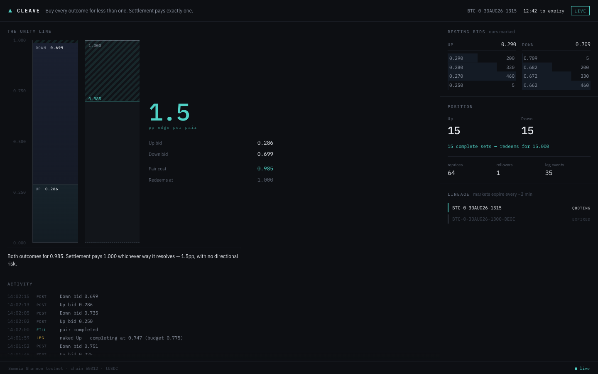
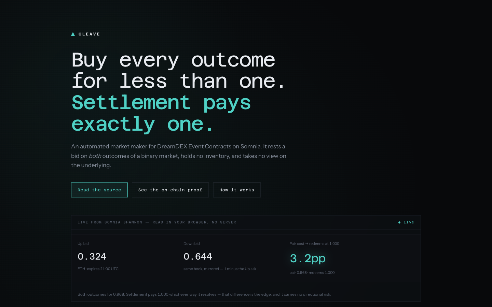

<h1>Cleave</h1>

**Buy every outcome for less than one. Settlement pays exactly one.**

**[Watch the demo](https://youtu.be/TbUcrJLFkA8)** (2:28) ·
**[cleave-ecru.vercel.app](https://cleave-ecru.vercel.app)** reads Somnia live in
your browser, so the claim is checkable against the chain while you read it.

An automated market maker for DreamDEX Event Contracts on Somnia. It rests a bid
on *both* outcomes of a binary market at prices summing to less than 1, holds no
outcome tokens, and takes no view on the underlying.

Built for the **Somnia × DreamDEX Event Contracts Hackathon**.

---

## Verify it in four seconds

An Up share and a Down share together are a **complete set**, and a complete set
redeems for **exactly 1** regardless of how the world turns out. So if you can
buy both for less than 1, the difference is yours and no price move can take it.

```
Up  bid    0.489
Down bid   0.483
           ─────
pair       0.972      redeems at 1.000     ->  2.8pp, no directional risk
```

That is the entire product. Everything below is evidence that it is real.

## Nothing here is mocked

There is no demo mode, no seeded fixture, and no fallback data path. Every figure
on screen comes from the indexer or the chain; when data is absent the interface
says so. These are transactions this code produced on Somnia Shannon:

| What | Transaction |
|---|---|
| Complete set minted, 1 tUSDC to 1 Up + 1 Down | [`0x63fa4e26`](https://shannon-explorer.somnia.network/tx/0x63fa4e26d06c9aab9a5d385110b9ddad82b9651b55a97bf14b89f3c3cd1a4842) |
| Merged back, exact, no leakage | [`0x210c57e4`](https://shannon-explorer.somnia.network/tx/0x210c57e47e732a348bb040b3e90cce6dd4bfa36ac9879b82394809682fec8ea1) |
| First maker order resting | [`0x29f61034`](https://shannon-explorer.somnia.network/tx/0x29f610342a8c9e70880a0d148da2d551d82845e353f8655bfd68f3f0d32b4e8c) |
| Up leg filled | [`0x6b1de65d`](https://shannon-explorer.somnia.network/tx/0x6b1de65d4066ecc1cb0513c12658909d88f6c74f41eebba65498aedc6440e7a1) |
| Down leg filled | [`0x339a4102`](https://shannon-explorer.somnia.network/tx/0x339a41025d67ac75b4345b81431ea9a57acb2972746a0c1539f59a418dbee3f8) |
| Winnings redeemed, **+20.000 tUSDC** | [`0xb785b4f0`](https://shannon-explorer.somnia.network/tx/0xb785b4f03a6f0fcc68be476ad4dd617dd667ef21d6d3fac1531d91cb1116afd3) |

Wallet: [`0x068bc3d7…B65E`](https://shannon-explorer.somnia.network/address/0x068bc3d79326b19068b3783714103c2be6eaB65E)

[`docs/preflight-baseline.md`](docs/preflight-baseline.md) is the working log 
every measurement, every wrong turn, and the evidence for each claim here.

## How it works

**Two bids, never a sell.** Selling an outcome you do not own reverts with
`InsufficientBalance`. There is no naked short. But *buying* both outcomes needs
only collateral, and the venue mints the pair when two opposite-side buyers
cross. So the maker never holds inventory and never carries direction.

**An edge floor, not a chase.** `watchOrderBook` includes our own resting order,
so quoting one tick inside the best bid means outbidding *ourselves*, a ratchet
that walks the edge to zero. Quotes are scaled so a pair never costs more than
`1 − MIN_EDGE`. The edge is the product; we do not spend it on queue position.

**Leg risk, handled out loud.** If one bid fills and the other does not, we hold
a naked outcome. The loop completes the pair by crossing, but only while the
total stays under 1. Above that it holds and says so:

```
LEG   naked leg, completing at 0.560 exceeds budget 0.433; holding
```

**Rollover.** Markets expire every couple of minutes and carry no successor
pointer, only an interval. The loop re-selects on the same asset and cadence, and
rolls 20s early because the book locks before the stated expiry.

**Position is read from the chain.** Never from `fetchPositions`, see Limits.

**Book value, marked to market.** The instrument answers "is this working" with a
number and shows the derivation, so it is checkable rather than asserted:

```
Equity          9560.02        Session  +3.47
Free collateral                        9540.11
In resting bids                           4.90
Complete sets  at par                    15.00
Unmatched leg  at book                    0.00
```

Complete sets are marked **at par** because they redeem at exactly 1.000 whatever
happens; marking them at the book would imply risk that does not exist. Only the
unmatched leg is marked at the book, because only it carries price risk. Wallet
balance alone is wrong here: resting bids move collateral out of the wallet, so
equity must include what is committed to open orders or a working maker looks
like it is losing money.

## The interface

One screen, hand-built. No framework, no component library, four UI dependencies
short of zero.



The **unity line** is the argument rendered as an object. Up and Down stack
toward a fixed 1.000 and the space left over *is* the edge. That gap is
genuinely 1–3pp, so a true-scale column shows a sliver. Rather than inflate it, a **vernier** expands 0.950–1.000 alongside where the same quantity is
legible. Coarse for honesty, fine for reading.

Colour is derived from the mechanic rather than chosen: `under` / `at` / `over`
relative to unity, and `resting` / `paired` / `naked` / `rolled` for lifecycle.

## The site

[`site/index.html`](site/index.html) is a single static file that **reads Somnia
live from the browser**. No server, no key, no build step. It queries the
indexer directly (CORS is open) and shows the pair cost currently available on
the venue, so the claim on the page is checkable against the chain while you
read it.

Deployed at **[cleave-ecru.vercel.app](https://cleave-ecru.vercel.app)**.
`vercel.json` sets `site` as the output directory, so `vercel deploy --prod`
ships it. Any static host works.



Building it surfaced the mechanic in the raw data: **there is no `BUY_NO` row in
the order book at all.** The venue expresses the whole book in YES terms: a bid
for Down *is* an ask for Up, mirrored, so `down = 1 - min(SELL_YES)`. The "one
book, two sides" claim is visible in the schema, not just the docs.

## Run it

```bash
npm install
cp .env.example .env && npm run newkey     # fresh testnet key, written 0600
# fund the printed address with STT, then:
npm run fund                                # SDK mints 10,000 tUSDC
npm run serve -- --live                     # interface + engine, http://localhost:5173
```

| Command | |
|---|---|
| `npm run preflight` | read-only proof the stack is live |
| `npm run spread` | spread survey across every live market |
| `npm run maker -- --live` | the loop, in the terminal |
| `npm run serve -- --live` | the loop, with the interface |
| `npm run set -- --live` | complete-set mint/merge round trip |
| `npm run claim -- --live` | sweep settled markets and redeem |

`--short` targets fast-expiring markets so rollovers happen on demand. Useful for
seeing the mechanism; **not representative**, it selects the venue's most
volatile markets, which is the worst ground for this strategy. See Limits.

## Limits

Stated plainly, because they are the first thing worth asking about.

- **Testnet only.** Somnia Shannon, chain 50312, tUSDC. Unaudited, no mainnet.
- **The venue has almost no organic flow.** Spreads sit in a 0.8pp band across
  every market with near-identical depth: one fixed-width quoter, not a market.
  Our fills come largely from it. Numbers here would not survive contact with
  real adversarial flow, and we are not claiming otherwise.
- **Some fills were bought deliberately.** To exercise settlement we crossed both
  books once, paying the spread on purpose: a 0.140 tUSDC loss, visible in the
  transactions above. That is the strategy run backwards, to manufacture a
  settled position.
- **No on-chain reactivity.** Somnia's on-chain reactivity needs a ~32 SOM
  subscription balance. This project runs at zero cost, so liveness uses the
  node's WebSocket feed instead. A deliberate trade, not an oversight.
- **`VENUE_ID` moves.** It changed three times in the first week of August.
  Nothing hardcodes it as truth; preflight reads live venue ids off market rows.
- **Single market at a time.** The loop quotes one series. Concurrent series is
  the obvious extension and is not built.
- **The mechanism is proven; profitability is not.** Two measured sessions came
  in at **+3.47** and **−31.88** tUSDC. Leg risk is the dominant term, and on a
  venue whose only counterparty is one fixed-width bot a sample this small cannot
  establish an edge in either direction. The demo says the same thing. Anyone
  claiming a market maker is profitable off two sessions is guessing.

## SDK feedback

Required as a deliverable, and collected as it happened rather than written at
the end, [`docs/preflight-baseline.md`](docs/preflight-baseline.md) has the
reproductions. The theme is that **real preconditions surface as parameter
errors**:

1. `getMarketOnchain` throws `v2 resolves markets by marketId through the module`
   when `addresses` is unset. The cause is a missing address; the message names
   the symptom.
2. `faucet()` defaults to a 10,000,000 gas ceiling and bids ~60 gwei against a
   6 gwei base, reserving **0.6 STT for a call that burns 0.008**, so the one call meant to bootstrap a wallet fails on exactly the wallet state it exists
   to bootstrap. It surfaces as `Missing or invalid parameters`, with
   `insufficient balance` six frames down the cause chain.
3. `createOrder` issues an internal `approve` at that same ceiling, and neither
   `SomniaMarketsConfig`, `setSigner()` nor `CreateOrderParams` exposes `gas`.
   The documented happy path is unusable under 0.6 STT.
4. **`fetchPositions` reported flat through an entire session in which we were
   repeatedly filled.** This is the dangerous one: the loop was blind to its own
   money, carried naked legs into settlement, and the leg-risk handler never
   fired. Outcome balances must be read from the ERC-6909 singleton whose address
   and ids come from `getMarketOnchain`.
5. `balanceOf` on `poolAddress` reverts: outcome tokens live on that shared singleton, not the pool.
6. Settled markets leave `loadMarkets` entirely as pools recycle by nonce.
   `listPastBinaryMarkets` is the only way to find a redeemable position, and it
   is on `exchange.client`, not the package root.

Net: **anything gating a trading decision must read the chain.** The indexer is
for discovery; it is not a source of truth about your own money.

## Licence

MIT.
